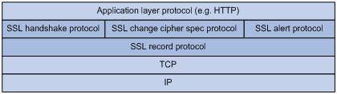

## SSL/TLS

#### 一、作用
###### 1.所有信息进行加密传输，防止被窃听
###### 2.具有校验机制，防止信息被篡改，一旦篡改，通信双方会立即发现(SSL利用mac算法可以将密钥和任意长度的数据转换成固定长度的数据，计算出对应的mac值并发送给接收者，接受者利用同样的密钥计算出对应的mac值进行比对，相同则正常，不同则丢弃报文)
###### 3.具备身份证书，防止身份被冒充

#### 二、运行过程

##### 需要了解的术语和知识点


###### ssl record protocol ssl记录层
###### SSL握手协议（SSL handshake protocol): 用来协商通信过程中使用的加密套件（加密算法、密钥交换算法和MAC算法等）、在服务器和客户端之间安全地交换密钥、实现服务器和客户端的身份验证。

###### SSL密码变化协议（SSL change cipher spec protocol):客户端和服务器端通过密码变化协议通知对端，随后的报文都将使用新协商的加密套件和密钥进行保护和传输。
###### SSL警告协议（SSL alert protocol）:主要负责对上层的数据（SSL握手协议、SSL密码变化协议、SSL警告协议和应用层协议报文）进行分块、计算并添加MAC值、加密，并把处理后的记录块传输给对端。

###### 公钥加密法： 客户端向服务器索要公钥，然后用公钥对信息加密发送给服务器端，服务器端收到密文后，用自己的私钥进行解密。
###### 对称加密： 同一个密钥可以同时用作信息的加密和解密。
###### 非对称加密： 需要两个密钥，私钥和公钥，服务器生成公钥和私钥，公钥用来向需要的客户端公开，然后客户端可以通过公钥对信息进行加密发送给服务器，然后服务器通过它独有的私钥进行解密
###### 数字证书： 包含用户的公钥及其身份信息的文件，证明了用户与公钥的关联，由权威机构ca签发，并由ca保证数字证书的真实性

##### 运行步骤
###### 1. 客户端向服务器索要并验证公钥
###### 2. 双方协商生成“会话密钥”（每一次对话都会生成一个“会话密钥”(session-key)，由于会话密钥是对称加密，所以运行速度会很快，服务器公钥(非对称加密)只用来加密“会话密钥”本身，这样就减少了加密运算的时间））
###### 3. 双方采用“会话密钥”进行通信

```
  1. 客户端向服务端发送请求  第一次随机数
  2. 服务端返回客户端 数字证书 第二次随机数
  3. 客户端用自己的公钥去解密证书  第三次随机数
  4. 确认证书没问题，客户端会生成一个对称加密的随机数并用刚刚解密服务器的公钥对数据进行加密，然后发送给服务器端
  5.服务器端收到以后会用自己的私钥对客户端发来的密钥进行解密
  6.之后双方使用对称密钥进行通信
```

##### 1,2阶段详细过程 简称 握手 之前需要建立 TCP 连接
1. 客户端向服务器发送加密通信的请求，提供了： 支持的协议版本(如TLS1.0)，随机生成了一个随机数，支持的加密方法(如RSA公钥加密)，支持的压缩方法，还可以提供客户端向服务器端所请求的域名
2. 服务端收到请求后向客户端发出回应：1.确认使用的加密通信协议版本，如果浏览器和服务器支持的版本不一致则关闭通信 2.随机生成一个随机数 3.确认加密方法 4.服务器证书   如果服务器要确认客户端身份就会向客户端请求一份客户端证书
3. 客户端再回应 1.生成一个随机数(pre-master key预备主密钥)，该随机数用服务器公钥加密 2.编码改变通知，表示稍后的信息都将用双方协商好的加密方法和密钥发送 3. 客户端握手结束通知
4. 服务器端最后的回应： 1.编码改变通知 2.服务器握手结束通知

之后的通信全部将采用http协议，只不过是通过“会话密钥”加密后的内容


