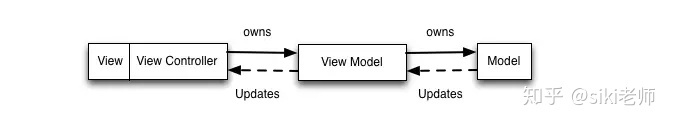

 ## MVVM
 
 四个概念
 1. Model: C被融入到M层中

 2. View

 3. ViewModel

 4. 绑定器

MVVM 在 React 中的 对应关系

1. Model: 对应组件的方法 或 生命周期函数中实现的业务逻辑  和   this.state中保存的本地数据。  如果 React 集成了 redux 那么业务逻辑和本地数据可以完全解耦出来 放在 Reducer 和 Action中。

2. VM: 对应组件中的JSX, 可以理解为 Virtural DOM的 语法糖。 React-dom 会把Virtural DOM 渲染成浏览器中的真实DOM

3. View: 对应真实的DOM

4. 绑定器： 对应JSX中的命令 以及 绑定的 数据

react 也可以理解为是一个 dom 拼接工具，把数据拼成新 dom 替换旧 dom

单向数据绑定
   1. M层变化 可以自动更新到ViewModel, 但 ViewModel的 变化需要 手动更新到M
   
双向数据绑定
  1. 单向数据绑定 + UI事件监听(捕捉ViewModel的变化并更新到M层)
