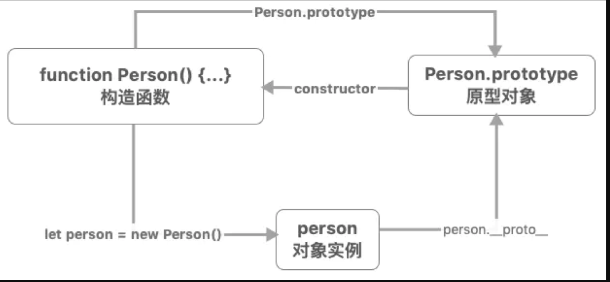

### Js: 
1. Promise如何实现 promise.last()
    
2. 深拷贝
    如何判断类型为Map，Set, Date
    * map、set、正则与object之间关系
        * typeof set === 'object'
        * set instanceof Object === true
    * 判断变量类型的方式，typeof 与 symbol
        * typeof
        * instanceof
        * **Object.prototype.toString.call()**判断作为稳妥
    * 需要考虑各种引用类型
        * Map
        * Set
        * Array
        * RegExp
        * Object
        * Date
        项目好坏的考量

3. ES6 module 与 commonJS区别？ 
    
    3.1 循环依赖问题如何解决？
        require: 
            a执行加载b时，会中断a的执行，去执行b文件，b文件中再加载a，就会导致b中调用的a没有被完全执行，就会造成循环加载的坑。
        import:
            ES6模块的运行机制，遇到模块加载命令import时，不会去执行模块，而是只生成一个引用等到真的要用到时，再去模块内取值。
        
    
    3.2 import / export 与 require / exports 的区别？

        1. import/export  浏览器有一定程度支持，使用上需要在<script>上增加type="module
            require/exports CommonJs只在node层运行使用
        2. require/exports 是运行时动态加载(运行时加载)，
            import/export 是静态编译(编译时存储引用),可以利用promise特性 上线动态加载
        3. require/exports 输出的是一个值的拷贝，import/export 模块输出的是值的引用
        4. import/export 导出的模块默认调用严格模式.
            require/exports 默认不使用严格模式，可以自定义是否使用严格模式

    3.3 require执行方式
    ```javascript
            // require命令第一次加载改脚本就会执行整个脚本，并生成一个对象。

            {
                id: '', // 模块名
                exports: { ... }, // 模块输出的各个接口
                loaded: true, // 当前模块脚本是否执行完毕
                filename: '/home/ruanyf/tmp/a.js', // 文件的绝对路径
                paths: [
                    '/home/ruanyf/tmp/node_modules',
                    '/home/ruanyf/node_modules',
                ], // 可能是当前模块的位置集合
                parent: { Object }, // 父模块
            }

            做的事情： 
            1. Resolution ／ 解析路径 得出真正的绝对路径
                Module._resolveFilename() // 确定模块的绝对路径，如果是内置模块则不含路径返回
            2. Loading ／ 加载代码
                module.load() // 加载模块
                2.1 Wrapping ／ 包装
                    function (exports, require, module, __filename, __dirname) {
                        const m = 1;
                        module.exports.m = m;
                    }
                2.2 Evaluation ／ 评估执行
                2.3 Caching ／ 缓存
    ```
4. 字符串替换

    replaceAll(/(\d{4})/, function(a, b) => { return ;})

5. 节流与防抖


乞丐版
```javascript
    function debounce(fn, time) {
        let timer;
        return () => {
            clearTimeout(timer);
            timer = setTimeout(() => {
                fn(...arguments);
            }, time)
        }
    }


    function throttle(fn, time) {
        let timer;
        return () => {
            if (!timer) {
                setTimeout(() => {
                    fn(...arguments);
                }. time);
            }
        }
    }


```

```javascript
    function debounce(fn, delay) {
        let timer = null;

        return function() {
            let context = this;
            let args = arguments;
            clearTimeout(timer);
            timer = setTimeout(function() {
                fn.apply(context, args);
            }, delay);
        }
    }

    function throttle(func, delay) {
        let timer = null;
        
        return function() {
            let context = this;
            let args = arguments;
            if (!timer) {
                timer = setTimeout(function() {
                    func.apply(context, args);
                    timer = null;
                }, delay);
            }
        }
    }
```

6. 原型
    
```javascript
    funtion a() {}
    b = new a();
    b.__proto__ === a.prototype // true
```

7. async await实现原理

8. 闭包、词法作用域
    闭包是一个基于词法作用域下，有记忆的，且有权访问另外一个函数作用域中变量的函数。
    
    如果嵌套函数是作为返回值返回的或者存储在某处的属性里，那么就会有一个外部引用指向这个嵌套函数，那么嵌套函数就不会被当作垃圾回收，它在作用域链中绑定局部变量的对象也不会被回收。

    是因为一个函数被当前函数作用域外部的变量引用了，除非外部的变量被释放，否则闭包当然不会被回收。

9. JS性能优化
    1. 合并js文件，减少请求次数，
    2. 阻塞式引用 将script标签放在body尾部，无阻赛式引用 可增加defer和async属性。async 下载完成后立即执行 defer 等页面加载完成后再执行
    3. 不适用with,eval语句，减少层级嵌套
    4. 较少DOM的操作次数
    5. 使用事件委托来减少事件处理器的数量
    6. 把最有可能命中的条件放在首位
    7. 用变量去缓存一些常量
    8. 条件多余3使用switch 而不是 if

10. 事件循环
    1. 微观任务
        promise, async, process.nexttick(node独有)，mutationObserver
    
    2. 宏观任务
        script, setTimeOut, setInterval, setImmediate, I/O, UI交互事件
    
    浏览器会优先执行一个宏任务，接下来有异步代码再执行微任务，接着微任务执行完毕如果需要则更新UI，接着执行宏任务开启下一轮eventloop。

    宏任务，由 事件触发线程 维护，微任务则由JS引擎线程维护

    事件触发线程： 当一个事件被触发时，该线程会把当前的任务放到待处理队列的队尾，等待js引擎去处理

    Node中的event loop和浏览器的完全不同，主要分为6个队列，依次执行

    Timer: 执行setTimeout,setInterval的回调,并且是由poll阶段进行控制

    I/O: 执行一轮循环中少数未执行的 I/O 回调

    idle, prepare: node内部实现

    poll: 回到 timer 阶段执行回调,执行 I/O 回调
        当回调队列不为空，则执行回调
        当回调队列为空，如果setImmediate队列存在，则会停止当前阶段直接进入check，如果setImmediate队列不存在，则会等待回调事件并执行，当然会有超时判断。

    check: 执行setImmediate

    close callbacks: close事件

    process.nextTick是独立于事件循环外的nextTick队列，当某个阶段结束 就会优先执行当前队列中的事件

11. typeof 和 instanceof
    typof 可以 判断出 除了null 以外的原始类型， function 会返回 function
    instanceof 会通过原型链机制 判断对象类型

    typeof null 返回'object' 代表对象被什么，但存放了空指针

12. this指向
    1. 箭头函数，包裹箭头函数的普通函数中的this
    2. 普通函数被使用时，使用new 时，this则指向实例化对象，非new，执行时 如果为 fn() 则为window 如果为 parent.fn() 则指向 parent
    3. 如果使用了 call,apply,bind 则指向他们的第一个参数

13. promise为了什么？
    解决回调地域的问题。

14. 基本类型 对象类型
    基本类型中除了 NaN !== NaN 以外 别的都相等， 

15. JSON.stringfy 深拷贝的缺陷， 能否正确返回正则
    1. undefined 会丢失
    2. 无法正确拷贝 正则、Error对象，只能得到一个空对象
    3. Date对象将只能变成一个字符串
    4. 如果存在NaN，Infinity 都将转成null
    5. 当出现循环引用的时候也无法正常拷贝
    6. 只能序列化对象的可枚举的自由属性，如果对象是通过构造函数生成，将会丢失对象的constructor

16. script异步标签
    <script type="module"> == <script defer> 异步加载，等页面渲染完成再执行
    <script async> 一旦下载完成，就会阻塞渲染引擎执行js文件 