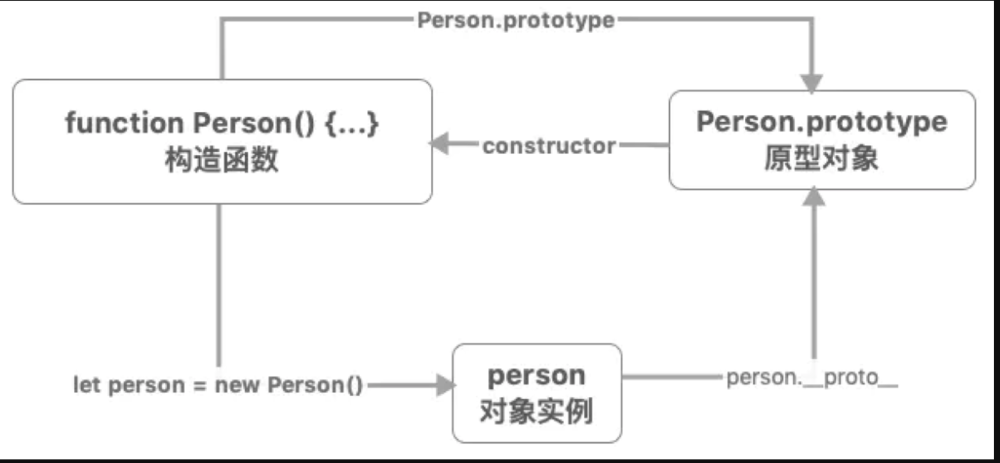

# 学习记录
## 3.15
### 框架 VUE: 
1. Vue3 关于 proxy数组劫持有何特殊之处？
    ```javascript
            var proto = [1, 2];
            var obj = new Proxy(proto, {
            get(target, key) {
                console.log('get', key)
                return Reflect.get(target, key)
            },
            set(target, key, value) {
                console.log('set', key)
                return Reflect.set(target, key, value)
            }
            })

            obj.map(v => v);
            VM2869:4 get map
            VM2869:4 get length
            VM2869:4 get constructor
            VM2869:4 get 0

            obj.push(10);
            VM2869:4 get push
            VM2869:4 get length
            VM2869:8 set 2
            VM2869:8 set length
            3


            

    ```
2. vue 数据驱动原理

        
3. React 和 Vue 有何区别？
    
    diff算法有什么不同？
    
    key作用有什么不同？

    https://juejin.cn/post/6844904158093377549
        

4. MVVM组件间通信方式

5. 常见路由的组织形式及注意点

6. Vue 双向绑定原理

7. Vue $nextTick 实现原理

8. Vue3 有哪些新特性？新的生命周期？

9. MVVM思想

### Js: 
1. Promise如何实现 promise.last()
    
2. 深拷贝
    如何判断类型为Map，Set, Date
    * map、set、正则与object之间关系
        * typeof set === 'object'
        * set instanceof Object === true
    * 判断变量类型的方式，typeof 与 symbol
        * typeof
        * instanceof
        * **Object.prototype.toString**判断作为稳妥
    * 需要考虑各种引用类型
        * Map
        * Set
        * Array
        * RegExp
        * Object
        * Date

3. ES6 module 与 commonJS区别？ 
    
    3.1 循环依赖问题如何解决？
    
    3.2 import / export 与 require / exports 的区别？

4. 字符串替换

    reolaceAll(/(\d{4})/, function(a, b) => { return ;})

5. 节流与防抖

6. 原型
    
   
### 算法： 
1. 有序数组中找k，二分查找

2. 二叉树

3. 链表

4. 快排、归并、冒泡、插入、

        
###  扩展知识
1. http/2.0优点

2. 性能优化
    1. 从文件大小考虑
    2. 从 script 标签使用上来考虑
    3. 从 CSS、HTML 的代码书写上来考虑
    4. 从需要下载的内容是否需要在首屏使用上来考虑

    图片优化
        1. 减少像素点
        2. 减少每个像素点能够显示的颜色、
        3. CSS去代替
        3. 小图使用BASE64格式
        4. 正确使用图片格式： 如小图使用SVG 照片使用JPEG

    DNS预解析
        DNS 解析也是需要时间的，可以通过预解析的方式来预先获得域名所对应的 IP
        <link rel="dns-prefetch" href="//yuchengkai.cn">

    节流、防抖

    预加载
        
        <link rel="prerender" href="http://example.com"> 

    懒加载
        
        懒加载的原理就是只加载自定义区域（通常是可视区域，但也可以是即将进入可视区域）内需要加载的东西。对于图片来说，先设置图片标签的 src 属性为一张占位图，将真实的图片资源放入一个自定义属性中，当进入自定义区域时，就将自定义属性替换为 src 属性，这样图片就会去下载资源，实现了图片懒加载。

    CDN
        CDN 的原理是尽可能的在各个地方分布机房缓存数据，这样即使我们的根服务器远在国外，在国内的用户也可以通过国内的机房迅速加载资源。

3. 跨域方式

4. SPA加载速度优化
    * HTTP2
    * 合并HTTP请求，如雪碧图，合并css、js文件
    * CDN
    * http缓存
    * Accept-Encoding gzip br deflate
    * 样式表放在头部，js放在尾部，减少代码大小
    * ssr
    * 懒加载
    * 按需加载

5. 前端内存优化

### CSS:
1. 响应式布局
    如何定义Rem  在html 标签下设置 font-size标准

### Webpack
1. webpack配置，loader、plugin 的区别

2. webpack性能优化
   1. babel编译优化
   ```javascript
    module.exports = {
        module: {
            rules: [
            {
                // js 文件才使用 babel
                test: /\.js$/,
                loader: 'babel-loader',
                // 只在 src 文件夹下查找
                include: [resolve('src')],
                // 不会去查找的路径
                exclude: /node_modules/
            }
            ]
        }
    }
    // 可以将 Babel 编译过的文件缓存起来，下次只需要编译更改过的代码文件即可，这样可以大幅度加快打包时间
    loader: 'babel-loader?cacheDirectory=true'

   ```
    2. HappyPack
    
    HappyPack 可以将 Loader 的同步执行转换为并行的，这样就能充分利用系统资源来加快打包效率了

    ```javascript
        module: {
            loaders: [
                {
                test: /\.js$/,
                include: [resolve('src')],
                exclude: /node_modules/,
                // id 后面的内容对应下面
                loader: 'happypack/loader?id=happybabel'
                }
            ]
            },
        plugins: [
            new HappyPack({
                id: 'happybabel',
                loaders: ['babel-loader?cacheDirectory'],
                // 开启 4 个线程
                threads: 4
            })
        ]

    ```

    3. DllPlugin
        DllPlugin 可以将特定的类库提前打包然后引入。这种方式可以极大的减少打包类库的次数，只有当类库更新版本才有需要重新打包，并且也实现了将公共代码抽离成单独文件的优化方案。
    ```javascript
        // 单独配置在一个文件中
        // webpack.dll.conf.js
        const path = require('path')
        const webpack = require('webpack')
        module.exports = {
            entry: {
                // 想统一打包的类库
                vendor: ['react']
            },
            output: {
                path: path.join(__dirname, 'dist'),
                filename: '[name].dll.js',
                library: '[name]-[hash]'
            },
            plugins: [
                new webpack.DllPlugin({
                // name 必须和 output.library 一致
                name: '[name]-[hash]',
                // 该属性需要与 DllReferencePlugin 中一致
                context: __dirname,
                path: path.join(__dirname, 'dist', '[name]-manifest.json')
                })
            ]
        }
    ```
    4. 代码压缩
    5. Tree Shaking
        Tree Shaking 可以实现删除项目中未被引用的代码, Webpack 4，开启生产环境就会自动启动这个优化功能。

### 浏览器
1. 浏览器渲染流程
    1.1 接受HTML文件
        字节数据 => 字符串 => Token => Node => DOM
    1.2 接受CSS文件
        字节数据 => 字符串 => Token => Node => DOM
    1.3 将DOM和CSSDOM合为渲染书Render Tree
    1.4 根据渲染书进行布局(回流)，调用GPU绘制，合成图层
2. 为什么操作DOM慢
    因为DOM在渲染引擎中，而JS在JS引擎中，通过JS操作DOM就会涉及两个线程之间的通信，且操作DOM会造成重绘回流等情况，所以就导致了性能上的问题。

3. 什么情况会阻塞渲染
    1. 浏览器在解析到script标签时，会暂停构建DOM，想首屏渲染越快，
        1.1 JS文件应该放在body标签底部。
        1.2 给 script标签添加defer(该JS文件会并行下载，但是会放到HTML解析完成后执行) 或者async属性(针对没有任何依赖的JS文件，表示JS文件下载和解析不会阻塞渲染)

4. 重绘 和 回流
    重绘： 意味着元素发生的改变只影响了节点的一些样式（背景色，边框颜色，文字颜色等），只需要应用新样式绘制这个元素就可以了；
    回流： 意味着元素的内容、结构、位置或尺寸发生了变化，需要重新计算样式和渲染树；

难点
  1. 继承 https://juejin.cn/post/6844903774964678664
```javascript  
    // 组合继承
    function Parent1() {
        this.name= 'parent1';
    }
    Parent1.prototype.say = function() {console.log('say')}
    function Child1() {
        this.name = 1;
        Parent1.call(this);
        this.type = 'child';
        
    }
    Child1.prototype = Parent1.prototype;
    a = new Child1();
    b = new Child1();
    console.log(a, b);
```
  2. 手写 reduce

  3. 手写 promise

  4. 手写call 
```javascript
    Function.prototype.call = function(context) {

        if (type of this !== 'function') throw new TypeError('ERROR');
        
        let context = context || window;
        
        context.fn = this;

        var args = [...arguments].slice(1);

        var result = context.fn(...args);
        
        delete context.fn;

        return result;

    }
```